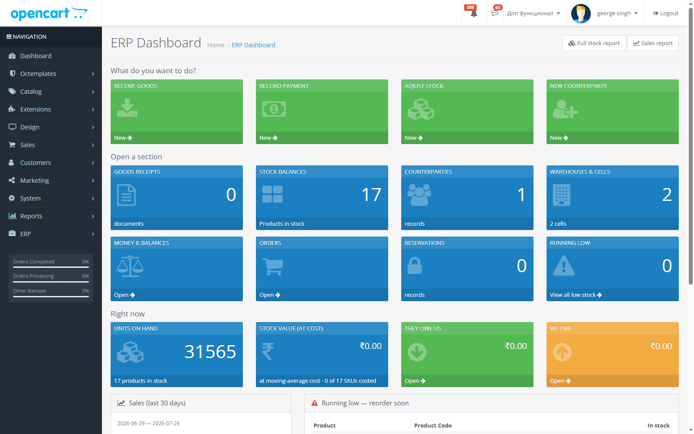
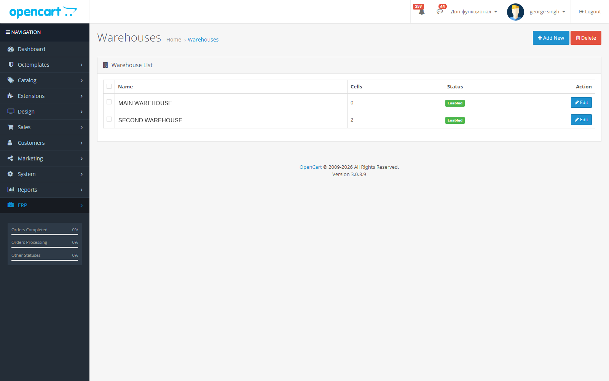
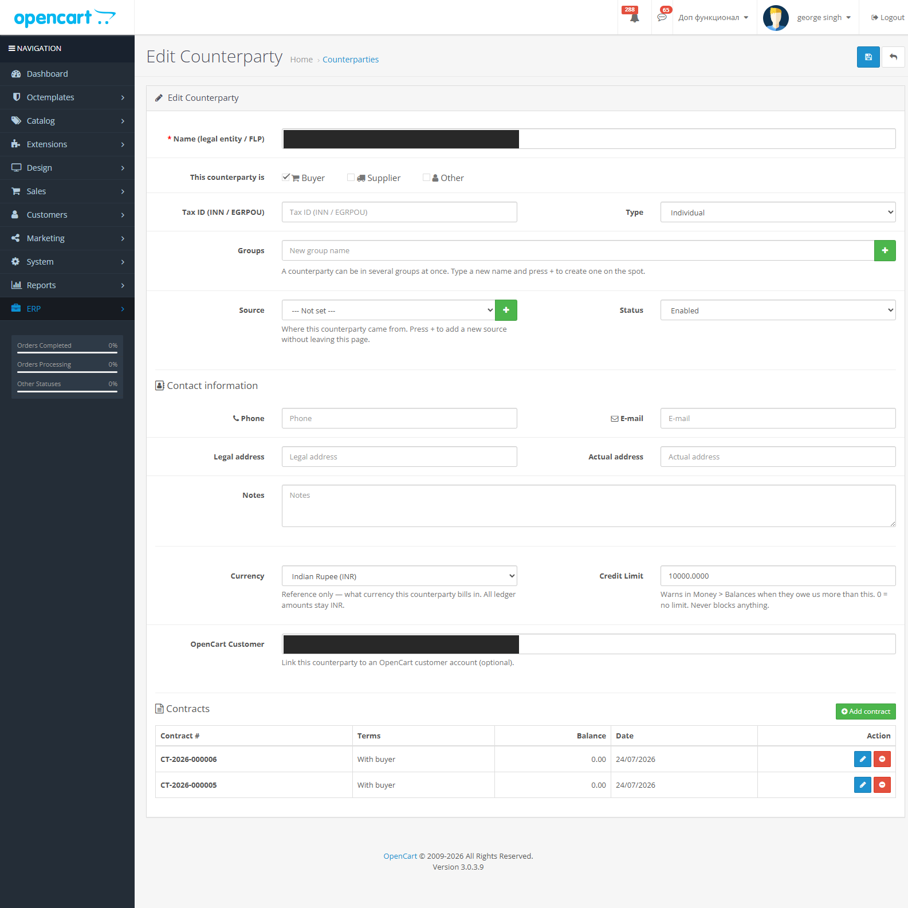

# An ERP inside OpenCart

OpenCart handles a catalogue and a checkout well. It does not handle warehouses, stock
costing, supplier debt, multi-currency ledgers, or anything that resembles a CRM. The
usual answer is to buy a separate ERP and then spend a year keeping two databases in
agreement with each other.

I did the other thing. The ERP got built as OpenCart modules, in the admin panel the
staff already had open all day, against one database. It went onto a live wholesale
store with real orders running through it, and stayed there for the whole build. That
constraint shaped most of what follows.

**There's no source code in this repo.** It was client work. What's here is a write-up
and four redacted screenshots. Happy to go through the implementation properly in an
interview.

| | |
|---|---|
| Role | Sole developer |
| Duration | July to August 2026 |
| Stack | OpenCart 3.0.3.9, PHP, MySQL, Twig, jQuery |
| Size | ~70,000 lines of PHP, 273 files, 44 installable submodules |
| Delivery | 12 numbered modules, each one deployed and checked on the live store |

---

## What got built

### The core

A dashboard in front of everything else: shortcuts for the four things people do twenty
times a day, counters per section, and live figures for units on hand, stock value at
moving-average cost, and what's owed in both directions.

**Inventory.** Warehouses and cells, with manual fulfilment for orders that don't follow
the happy path. Stock balances across the whole catalogue, adjustments, low-stock
alerts. Goods receipt with moving-average costing, plus receipt journals and line-level
detail.

Two decisions here are worth pulling out. Stock gets reserved at order time rather than
at dispatch, and that on its own is what stopped the overselling. And boxes are derived
from order lines instead of being stored as their own records, so box contents can't
drift away from what was actually sold. Storing them separately would have been easier
to write and would have started lying within a month.

**Finance.** Cash accounts, cashflow, bank statements, payment documents. A debt ledger
showing who owes us and who we owe, per currency, with a roll-up into one currency for
the people who just want the number. Multi-currency with FX rates that refresh
themselves, no cron involved. Purchase orders, sales orders, sales invoices, goods
issue, returns. Product tax with HSN codes and generated print forms.

**CRM.**

Counterparties pull buyers and suppliers into a single record: contacts, contracts,
groups, a per-counterparty currency, and a credit limit. The limit warns, it doesn't
block. That was deliberate and slightly unpopular at the time. A hard block would fire
exactly when someone is trying to close a deal, and the person it blocks has no way to
override it, so you get a workaround culture instead of a control.

Existing OpenCart customers link into counterparties rather than being merged into them.
That closed a long-running duplicate-records problem without a migration that could go
wrong once and take the customer table with it.

### Messaging

Sales conversations were happening on WhatsApp, on Telegram, and over email, and none of
it was written down anywhere near the order. So: a unified inbox on the order screen.
WhatsApp through a self-hosted Evolution API on Docker, plus Telegram, Viber, and email
over SMTP. Text, voice notes, images, video, documents. Unread badges surface in the
order list so nothing sits unanswered.

### Shipping

Courier API integration: AWB generation, status polling, cancellation, and a webhook for
push updates. Validated against the live API, not against mocks.

---

## Notes from the build

**OCMOD matches one line at a time.** OpenCart 3 splits the target file on `\n` and runs
`stripos` per line, so a multi-line `<search>` block can never match anything. It fails
silently. No error, no log line, the operation is skipped and the file just never gets
patched. The order-window panels didn't render for about a week before I worked that
out, because their anchor was three lines long. Every anchor after that was a single
unique line, using `index` to pick the right occurrence and `offset` to insert at a
sensible boundary.

**Check where `storage/` actually is.** If it's been moved outside the webroot, the old
directory usually still exists and is empty. So the obvious place to look will tell you
that nothing is compiled and there are no logs, and it will be wrong about both. Read
`config.php` first.

**Additive, always.** New tables are `oc_erp_*` on InnoDB/utf8mb4, sitting next to
OpenCart's own MyISAM/utf8 tables with no foreign keys crossing between them. Cart and
order hooks went through `oc_event` in the places where OCMOD would have been fragile.
Core files stay patchable and the store can still take an upgrade.

**Write it down while you still remember.** There's a dev log recording each module and
what was verified live. More useful than that, it records which of its own earlier
entries turned out to be wrong. Those got struck through instead of deleted, so six
weeks later I could still see why I'd believed the wrong thing.

---

## What I'd do differently

Scope grew module by module out of client feedback. That kept every release useful, but
it meant the finance and document layers ended up sharing concepts they should have been
sharing on purpose from the start. It surfaced later as a merge of adjustments and
journals that I'd rather not have needed. Next time I'd model documents generically
before building the first one.

The other thing is staging. I'd push much harder, much earlier, for a copy of the store
to deploy against. Verifying on production is survivable, and I did survive it, but
every single deploy is heavier than it needs to be and you end up doing your careful
thinking at the wrong end of the process.
